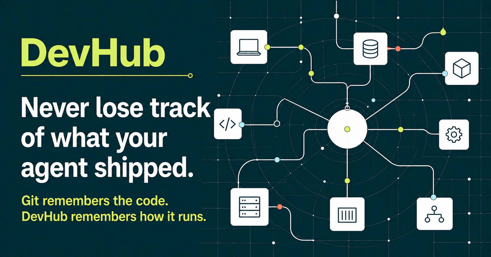

# DevHub

> **The home for what you shipped.**

> **Never lose track of what your agent shipped.**

Your coding agent can build and deploy it. DevHub preserves the operational
context around what exists, where it runs, what's current, and what to do next.

> **Git remembers the code. DevHub remembers how it runs.**

DevHub is a self-hosted operational map for software built and operated with
coding agents. It keeps the facts that source control alone does not: what
exists, where it runs, which entry point is reviewed, what is current, and what
still needs attention.



DevHub combines:

- a Git-backed catalog that you own;
- a lightweight read-only dashboard;
- the same reviewed catalog through read-only MCP; and
- explicit setup, verification, rollback and uninstall guidance for Codex and
  other coding agents.

It does not scan arbitrary ports, execute project commands, store secrets or
pretend missing evidence is healthy. Unknown stays unknown.

## Start here

**This GitHub page is the complete starting point.** Share this repository URL
with the person who will install DevHub:

<https://github.com/MrUversky/devhub-core>

### Set up with Codex

1. Open a new Codex task.
2. Paste the repository URL above.
3. Say:

> Set up DevHub for me from this repository.

That is enough. The reviewed [community first-run](docs/COMMUNITY_BOOTSTRAP.md)
tells Codex how to select and verify the current public release, install the
runtime, ask only recognizable setup questions, create the first catalog,
start the dashboard, verify MCP, and return recovery steps. The person does not
need to choose a release tag, understand plugin packaging, assemble JSON or run
the commands in the technical sections below.

At the end, Codex returns:

- the local or already-reviewed private dashboard URL;
- a separate user-owned Git catalog containing the reviewed project map;
- a read-only MCP connection plan;
- verification and idempotence results; and
- exact rollback and uninstall actions.

### Projects and DevHub releases are separate

A DevHub application release changes the DevHub software. Adding, updating or
removing one of your projects changes only your catalog through a normal
reviewed Git commit. **Catalog work does not require a new DevHub release.**
Rebuild or refresh the running dashboard against the accepted catalog revision;
do not package each project change as a DevHub version.

### Prefer to inspect first?

- [How the guided first run works](docs/COMMUNITY_BOOTSTRAP.md)
- [Installation and recovery](docs/INSTALLATION.md)
- [Codex integration](docs/INTEGRATIONS_CODEX.md)
- [Configuration](docs/CONFIGURATION.md)
- [Security boundary](SECURITY.md)
- [Optional owner-only Sites companion](docs/SITES_COMPANION.md)

## What DevHub answers

- What projects and runnable services are registered?
- Where does each service belong, and which entry point is reviewed?
- Is its state live, reported, stale, catalog-only or unknown?
- What reviewed guidance or evidence supports the next step?

The core promise is continuity: return to a project after weeks or months and
recover the context needed to continue. DevHub is not a metrics stack or a
universal process supervisor.

> **Self-hosted. Read-only by default. No secrets. Every catalog change
> reviewable.**

> **Release candidate:** the public repository is intended for evaluation and
> small self-hosted installations. macOS and Linux have reviewed first-run
> paths; unsupported platform or deployment claims remain explicit.

## Install DevHub

### Guided setup with Codex (recommended)

Use the three-line [Start here](#start-here) flow. Codex performs the machine
work and pauses at the existing review boundaries. Commands below document the
reproducible implementation; they are not homework for the person installing
DevHub.

### Manual plugin installation

Codex calls a GitHub repository that contains a machine-readable plugin listing
a **marketplace**. Here, `devhub-community` is only the plugin source stored in
this public repository. It is not a separate website, store or account, and its
presence does not by itself claim a listing in a universal plugin directory.

If you intentionally want to install the plugin by hand, pin the repository and
release assets to the same reviewed annotated public tag:

```bash
codex plugin marketplace add MrUversky/devhub-core --ref <TAG>
codex plugin add devhub@devhub-community
```

Then follow [Pinned user-wide CLI](docs/INSTALLATION.md#pinned-user-wide-cli)
and verify `devhub doctor --workflow --json` and
`devhub doctor --install --json`. The plugin supplies guidance; the
checksum-verified runtime is installed separately and works from any project
without `npm -g`, `sudo` or a source checkout.

### Run the dashboard from source

From a verified source snapshot:

```bash
npm ci
npm run dev
```

Open <http://127.0.0.1:3000>. Docker Compose remains an equivalent source-based
path in [Quick start with Docker](#quick-start-with-docker).

## Set up connections

Start in the dashboard or ask Codex, Claude Code or Cursor to **Set up my
DevHub**. The dashboard follows one honest handoff: **Choose sources → Run with
your coding agent**. Including a source does not connect it; it adds that source
to the bounded request you paste into a coding-agent task. The agent performs
the actual scoped setup and returns a reviewable proposal.

The connector library shows working sources first and keeps future providers
in a separate roadmap without claiming that a detected local tool is connected.
The hosted demo presents working connectors as a setup preview, not as personal
connection state. It hides viewer/device identity and private profiles while
keeping example host and runtime placement visible. A self-hosted **Private
workspace** shows its own reviewed connection state separately from
**Include in this run**/**Included** for the later agent run. The dashboard
uses reviewed redacted evidence to distinguish sources ready for an agent check
from sources that still need exact access or scope. The public demo shows
support only and never claims that readiness. The dashboard does not contact
providers. Setup reads only exact local markers, never
credential values or configuration contents, and never writes
catalog truth. See [Connected Setup](docs/CONNECTED_SETUP.md) for the complete
boundary.

The hosted page follows **install → setup → demo workspace**. **Get DevHub**
opens the three-step installation path; **Explore demo** opens a six-project
workspace across production, active, discovery and paused lifecycles. Project,
service and runtime-host totals sit beside that catalog. Each Guardian signal
has its own accessible explanation and filters directly to matching examples.

```bash
npm run devhub -- setup
npm run devhub -- setup-run --sources github,local-host --json
npm run devhub -- setup-session config/connection-profiles.example.json --json
```

Use `--json` when a coding agent will consume the plan. Copy the fictional
profile template, keep only relevant sources, and replace its account, host or
workspace identities. The next step is `discovery-inbox`, which groups unclear
resources for review and never writes them into the catalog.

To find previously unregistered local candidates, select one reviewed host and
one or more absolute roots explicitly:

```bash
devhub discover-local developer-laptop \
  --root /absolute/path/to/projects \
  --json
```

The command is bounded, isolated, no-follow and read-only. It emits the same
Discovery Inbox review contract without printing absolute workspace paths or
inferring accountable owner, mode, visibility or live state. See
[Bounded local discovery](docs/LOCAL_DISCOVERY.md).

## Refresh reviewed provider evidence

DevHub v0.7 includes narrow read-only GitHub adapters. Start from the fictional
`config/evidence-bindings/example-release.json`, replace its identities with a
repository and service already reviewed in your catalog, then run:

```bash
npm run devhub -- collect-evidence config/evidence-bindings/example-release.json --json
npm run devhub -- review-portfolio --json \
  --evidence-binding config/evidence-bindings/example-release.json
```

The result is a candidate, not an automatic catalog update. Review a minimal
YAML diff before dashboard or MCP can show the new evidence.

## Review a bounded provider inventory

DevHub can also enumerate one explicitly configured Railway workspace or
workspace-parented project and reconcile the normalized candidates with the
reviewed catalog:

```bash
npm run devhub -- inventory config/inventory-bindings/example-railway.json --json
```

The binding names an environment variable containing a read-only Railway token;
the token never enters JSON output or the catalog. Exact provider identities
may be mapped through reviewed decisions. Repository, domain and name matches
remain possible matches. Unregistered projects may include a stdout-only
overlay proposal, which must be reviewed, validated and merged separately.
See [Provider inventory](docs/PROVIDER_INVENTORY.md) and the
[Railway adapter](docs/RAILWAY_INVENTORY.md).

## Quick start with Docker

Requirements: Docker Engine with Compose v2.

```bash
docker compose -f deploy/docker/compose.yaml up --build -d
```

Open <http://127.0.0.1:3000>. The image is built from the included demo
catalog and runs as a non-root user with a read-only filesystem. Edit the
catalog before using DevHub for real infrastructure, then rebuild the image.
Container health verifies both the dashboard and read-only MCP initialization.

The application has no built-in user authentication. Keep the default
loopback binding, or put it behind a private network or an authenticated
reverse proxy. Do not expose it directly to the public internet.

## Run from source

Requirements: Node.js 22.13 or newer and npm.

```bash
npm ci
npm run devhub -- validate --check
npm run dev
```

For a production-style check:

```bash
npm run build
npm test
npm run lint
```

## Add your catalog

Start a separate catalog without editing or deleting the included demo:

```bash
npm run devhub -- init-catalog ./my-catalog \
  --host-id developer-laptop \
  --host-name "Developer laptop" \
  --host-kind mac \
  --host-location local
```

The default is a read-only plan showing every path. Review it, repeat with
`--apply`, then use `DEVHUB_CATALOG_DIR="$PWD/my-catalog"` for catalog commands
and the DevHub process. The initializer refuses non-empty destinations and
validates the created `hosts.yaml` plus empty `projects/` starter immediately.

1. Add one project file per project under `my-catalog/projects/`.
2. Never put passwords, tokens, private keys, cookies or secret-bearing URLs
   in a manifest.
3. Run `DEVHUB_CATALOG_DIR="$PWD/my-catalog" npm run devhub -- validate` to
   regenerate the reviewed runtime JSON.
4. Commit the YAML and generated JSON together.

Use `registration: native` when a repository you control should own
`.devhub/project.yaml`. Use `registration: overlay` when the metadata is
private or the source repository is shared or external.

See [Installation](docs/INSTALLATION.md),
[Configuration](docs/CONFIGURATION.md), [App Passport](docs/APP_PASSPORT.md),
[Connected Setup](docs/CONNECTED_SETUP.md),
[Coding-agent integrations](docs/INTEGRATIONS_AGENTS.md),
[Portfolio review](docs/PORTFOLIO_REVIEW.md),
[Reviewed stewardship](docs/STEWARDSHIP.md),
[Connector conformance](docs/CONNECTOR_CONFORMANCE.md),
[Read-only evidence adapters](docs/EVIDENCE_ADAPTERS.md),
[GitHub evidence adapters](docs/GITHUB_EVIDENCE_ADAPTERS.md),
[Vercel inventory and deployment evidence](docs/VERCEL_CONNECTOR.md),
[Sentry monitoring and release evidence](docs/SENTRY_EVIDENCE_ADAPTER.md),
and [Privacy](docs/PRIVACY.md).

Codex, Claude Code, and Cursor use the same read-only MCP and deterministic CLI
contract. Generate a client-native setup plan with `devhub agent-setup`; Codex
users can additionally install the portable workflow skill described in the
[Codex integration guide](docs/INTEGRATIONS_CODEX.md).

## Read-only MCP

The same process serves Streamable HTTP MCP at `/mcp`. It can list and search
projects, return service status and runbooks, and prepare reconciliation
context. It cannot mutate manifests, probe caller-supplied URLs or execute
commands.

Only connect clients you trust: MCP exposes the same operational metadata as
the dashboard and uses the deployment's network/authentication boundary.

## Project status

DevHub is pre-1.0 software. Good evaluation feedback includes installation
failures, confusing status semantics, portability gaps and catalog examples
that cannot be represented safely.

- [Contributing](CONTRIBUTING.md)
- [Security policy](SECURITY.md)
- [Support](SUPPORT.md)
- [Release and compatibility policy](docs/PUBLIC_RELEASE.md)

## License

Apache License 2.0. See [LICENSE](LICENSE).
